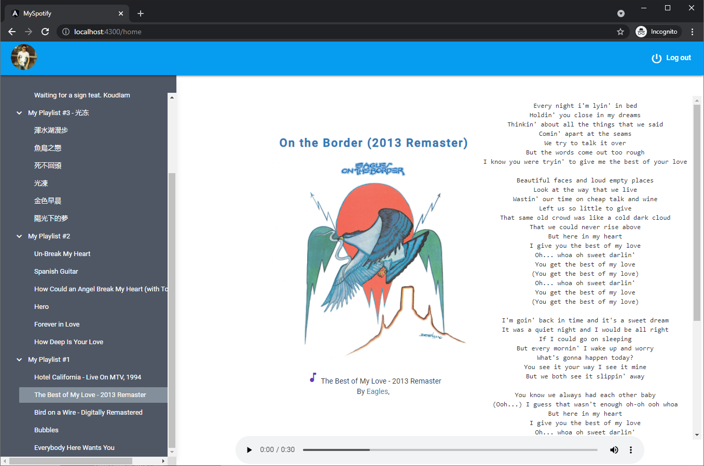

# Spotify with lyrics

This Angular+Node.js+Express application shows user's playlists from his spotify account. When user selects a track from left-pane list, the track starts to play, and track details as well as lyrics are shown in the righ-side pane. The backend Node.js app is used to authenticate to Spotify and retrieve lyrics in the internet.



## Installation

1) Clone the project
2) Go to your spotify dashboard page to register the application. After that, you will get client id and client secret for the registered app
3) In your local repo, go to 'server' direcory and create '.env' file with the information you get at step 2
```
REDIRECT_URI=[your_redirect_url]
CLIENT_ID=[your client id]
CLIENT_SECRET=[your client secret]
```
4) Run 'npm innstall'
```
cd client && npm install
cd server && npm install
```
5) Start the application
```
cd client && npm run start
cd server && npm run devStart 
```
You can now access the UI on <http://localhost:4300>. which connects to backend server on <http://localhost:4001>

